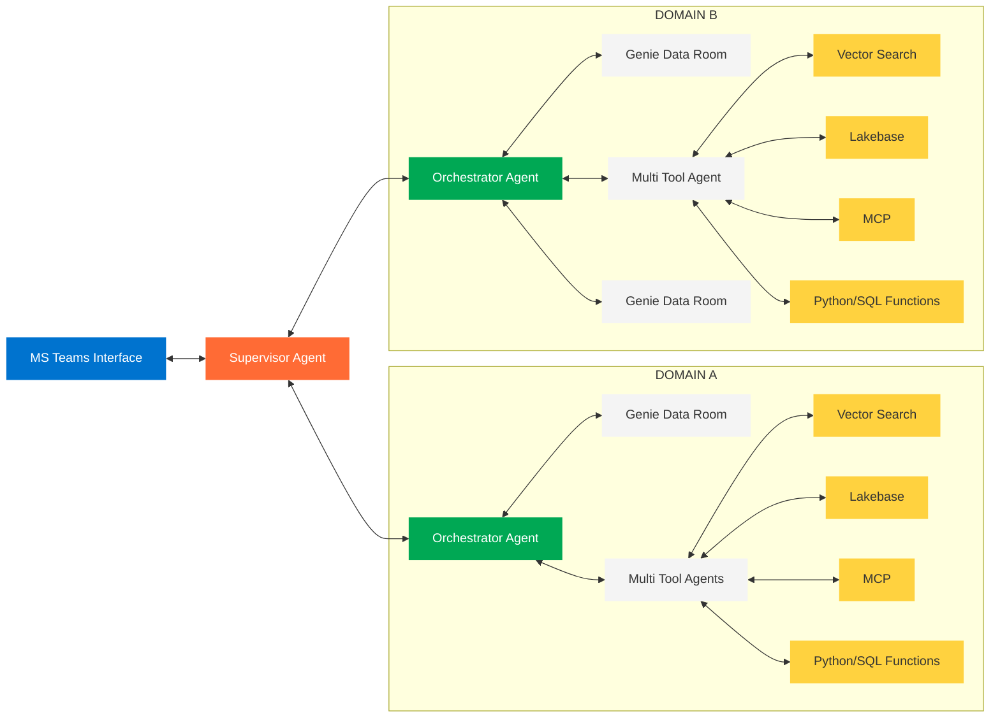

# Multi-Agent Architecture - Team Hub

A collaborative enterprise multi-agent systems. Exploring different approaches to multi-agent orchestration and Genie API integration.

## 🏗️ Target Architecture

### Architecture Overview

1. **MS Teams Interface**: User interaction layer for natural language queries
2. **Supervisor Agent (Level 1)**: Central orchestration and **only point of cross-domain communication**
3. **Domain Agent Orchestrators (Level 2)**: Generic business entity coordinators managing their own domains (Domain A, B)
4. **SME Agents**: Each domain orchestrator connects to its own dedicated agents:
   - **Genie Data Rooms SME Agents**: Domain-specific subject matter experts with specialized knowledge
   - **Multi Tool Agents**: Domain-specific tool experts handling computational and analytical tasks
5. **Domain-Exclusive Tools**: Each business silo has its own dedicated infrastructure:
   - **Vector Search**: Domain-specific similarity queries and knowledge retrieval
   - **Lakebase**: Low latency OLTP data
   - **MCP**: Domain-specific model context protocol connections
   - **Python Function**: Domain-specific code execution and computation

**Business Entity Silos**: Each domain operates as an isolated silo with its own specialized language, acronyms, and domain expertise. Tools remain exclusive within each domain boundary. **Cross-domain communication only occurs via the supervisor level**, ensuring clean separation of concerns while maintaining centralized coordination.

## 🎯 Team Contributions
Every Team will explore specific 

### 🚀 **[Multi-Layered Architecture](teams/multi-layered-architecture/README.md)**  - Supervisor patterns
- Supervisor of supervisors pattern
- Advanced hierarchical agent orchestration
- Streaming responses and disclosure management

### 🔗 **[ECT](teams/ect/README.md)** - Genie Rooms Orchestration
- Multi-Genie data room orchestration
- Cross Team learning

### 📊 **[Marketing Team](teams/marketing/README.md)** - Multi Tool Agent
- Vector Search integration
- Genie API integration for marketing data

### 🔒 **[Supply Chain Team](teams/supply-chain/README.md)** - OBO with RLS/CM security features
- Row-Level Security (RLS) implementation
- Column-Level Masking (CM) patterns
- OBO Genie API

## 📚 Documentation

- **[Multi-Agent Architectures Overview](docs/MultiAgentArchitectures.md)** - Complete architectural documentation with design patterns, flow charts, and implementation guides

## 📓 Example Notebooks

### Core Implementations
- **[FMAPI Streaming Supervisor](notebooks/06-supervisor-streaming-disclosure.py)** - Main FMAPI implementation with streaming responses
- **[MLflow Responses API](notebooks/MLFlow_Responses_API/)** - Response API patterns and integration examples

### Architecture Patterns
- **[Supervisor of Supervisors (legacy)](notebooks/05-supervisor-of-supervisors.py)** - Hierarchical supervisor pattern implementation
- **[LangGraph Multi-Agent (legacy)](notebooks/03-langgraph-multiagent-genie-pat.py)** - LangGraph-based multi-agent orchestration
- **[Agent Evaluation Metrics](notebooks/04-agent-evaluation-metrics-review-app.py)** - Comprehensive agent evaluation and metrics
- **[Tool Functions](notebooks/02-create-tool-functions.py)** - Utility functions for agent tool creation

