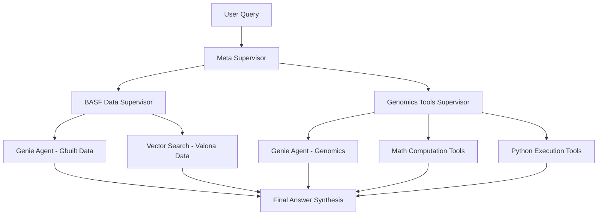

# Multi-Agent Architecture

A sophisticated multi-agent system implementing the supervisor-of-supervisors pattern using LangGraph and Databricks. This architecture enables hierarchical orchestration of specialized agents for handling complex, domain-specific tasks.

## 🏗️ Architecture Overview

### Supervisor-of-Supervisors Pattern



### Key Features

- **Hierarchical Agent Orchestration**: Meta-supervisor delegates to specialized supervisors
- **Smart Context Preservation**: Full conversation history with intelligent truncation
- **Robust Error Handling**: Graceful degradation when services are unavailable
- **Modular Design**: Easy to extend with new agents and capabilities
- **Production Ready**: Comprehensive testing, configuration, and deployment support
- **Comprehensive Testing**: 91% coverage, unit tests (3s) + integration tests (2-5min)

### 🚀 Quick Test Commands

```bash
# Fast unit tests (3 seconds, 91% coverage)
python run_tests.py --unit

# Integration health check (2-3 minutes)
python run_integration_tests.py --supervisor-health

# All endpoints status check
python run_integration_tests.py --health
```

## 📁 Project Structure

```
multi-agent-architecture/
├── src/multi_agent/           # 📦 Main installable package
│   ├── supervisor/            # Supervisor logic
│   │   └── supervisor_of_supervisors.py
│   ├── agents/                # Individual agents
│   ├── tools/                 # LangChain/LangGraph tools
│   └── utils/                 # Shared utilities
├── notebooks/                 # 📚 Usage examples & data setup
│   ├── 05-supervisor-of-supervisors.py
│   ├── 01.a-create-valona-data.py    # Data creation scripts
│   └── 01.b-create-reports-data.py
├── tests/                     # 🧪 Test suite
│   ├── unit/                  # Unit tests
│   │   ├── conftest.py       # Unit test configuration
│   │   └── test_supervisor/   # Supervisor unit tests
│   ├── integration/           # Integration tests
│   │   ├── conftest.py       # Integration test configuration
│   │   ├── test_databricks_connectivity.py # Databricks connectivity tests
│   │   └── test_supervisor/   # Supervisor integration tests
│   └── test_requirements.txt # Test-specific dependencies
├── run_tests.py              # 🛠️ Test runner
├── run_integration_tests.py  # 🛠️ Integration test runner
├── docs/                     # Documentation
├── config/                   # Configuration files
├── pyproject.toml           # ⚙️ Modern dependency management
└── CLI_USAGE.md             # 📖 Usage documentation
```

## 🚀 Quick Start

### Installation

```bash
# Clone the repository
git clone <repository-url>
cd multi-agent-architecture

# Install in development mode (includes dev tools)
pip install -e .[dev]

# Install with test dependencies
pip install -e .[test]

# Or install just the package
pip install -e .
```

### Basic Usage

```python
from multi_agent.supervisor.supervisor_of_supervisors import AGENT
from mlflow.types.agent import ChatAgentMessage

# Create a query
messages = [
    ChatAgentMessage(
        id="1",
        role="user", 
        content="What is the molecular structure of water and calculate its molecular weight?"
    )
]

# Get response
response = AGENT.predict({"messages": messages})
print(response.messages[-1].content)
```

### Running Examples

```bash
# Run the Databricks notebook version
# See notebooks/05-supervisor-of-supervisors.py

# Create sample data
python notebooks/01.a-create-valona-data.py
python notebooks/01.b-create-reports-data.py
```

## 🧪 Testing

The project includes comprehensive unit and integration tests with excellent coverage and performance monitoring.

### Quick Test Commands

```bash
# Run all unit tests (fast, ~3 seconds)
python run_tests.py --unit

# Run integration health checks (2-3 minutes)
python run_integration_tests.py --supervisor-health

# Run all tests
python run_tests.py
```

### Unit Tests

Unit tests provide fast, isolated testing of individual components without external dependencies.

```bash
# Run all unit tests with coverage (recommended)
python run_tests.py --unit

# Run unit tests without coverage
python run_tests.py --unit --no-cov

# Run specific test directory
python run_tests.py --path unit/test_supervisor

# Using pytest directly
pytest tests/unit/ -v --cov=multi_agent
```

**Unit Test Features:**
- ✅ **Fast Execution**: ~3 seconds for full test suite
- ✅ **91% Coverage**: Comprehensive code coverage  
- ✅ **27 Tests**: All major components tested
- ✅ **Mocked Dependencies**: No external API calls
- ✅ **Performance Tests**: Hot path optimization validation

### Integration Tests

Integration tests verify the complete system with real Databricks endpoints.

#### Endpoint Connectivity Tests

Test individual Databricks serving endpoints:

```bash
# Authentication tests
python run_integration_tests.py --auth

# Quick endpoint health check
python run_integration_tests.py --health

# All endpoint connectivity tests  
python run_integration_tests.py --connectivity

# Performance tests
python run_integration_tests.py --perf
```

#### Supervisor Integration Tests

Test the complete multi-agent supervisor system end-to-end:

```bash
# Supervisor health check (recommended for monitoring)
python run_integration_tests.py --supervisor-health

# All supervisor functionality tests
python run_integration_tests.py --supervisor

# Supervisor performance tests
python run_integration_tests.py --supervisor-perf

# Individual test methods
pytest tests/integration/test_supervisor/test_supervisor_integration.py::TestSupervisorBasicFunctionality -v
```

#### All Integration Tests

```bash
# Run all integration tests
python run_integration_tests.py --all

# Using pytest directly
pytest tests/integration/ -v -s --timeout=300
```

### Test Categories

#### Unit Tests (`tests/unit/`)
- **Context Building**: Message context handling and truncation
- **Agent Nodes**: Agent execution and error handling  
- **Final Answer**: Response synthesis for normal/error cases
- **Supervisor Logic**: Decision-making and routing logic
- **Performance**: Hot path optimization and memory usage

#### Integration Tests (`tests/integration/`)

**Endpoint Tests (`test_databricks_connectivity.py`)**:
- Authentication and workspace access
- Individual endpoint connectivity  
- Request/response functionality
- Performance and consistency testing

**Supervisor Tests (`test_supervisor_integration.py`)**:
- Basic functionality (BASF/Genomics routing)
- Advanced scenarios (multi-domain queries)
- Conversational flows with context
- Error handling and edge cases
- Performance monitoring and health checks

### Expected Performance

#### Unit Tests
- **Execution Time**: ~3 seconds
- **Coverage**: 91% (240/256 statements)
- **All Tests**: 27/27 passing

#### Integration Tests
- **Endpoint Health**: < 60 seconds
- **Supervisor Health**: 2-5 minutes  
- **Simple Queries**: < 2 minutes
- **Complex Queries**: < 5 minutes
- **All Endpoints**: 3/3 healthy

### Test Configuration

Tests are configured in `pyproject.toml`:

```toml
[tool.pytest.ini_options]
testpaths = ["tests"]
addopts = [
    "--strict-markers",
    "--strict-config",
]
markers = [
    "unit: Unit tests", 
    "integration: Integration tests",
    "slow: Slow running tests",
    "requires_databricks: Tests requiring Databricks connectivity",
]
```

### Prerequisites for Integration Tests

Integration tests require:

1. **Databricks CLI** configured with OAuth:
   ```bash
   pip install databricks-cli
   databricks configure --profile e2-demo-field-eng
   ```

2. **Access to Databricks endpoints**:
   - `genie_multi_agent_basf` (BASF Data Assistant)
   - `genie_multi_agent_basf_v2` (Genomics Tools Assistant)
   - `databricks-claude-3-7-sonnet` (Main LLM)

3. **Environment** (optional):
   ```bash
   export DATABRICKS_PROFILE=e2-demo-field-eng
   ```

### Continuous Integration

Tests are designed for CI/CD:

```bash
# Fast feedback (unit tests only)
python run_tests.py --unit

# Full validation (all tests) 
python run_tests.py && python run_integration_tests.py --supervisor-health
```

### Test Features

- ✅ **Clean Separation**: Unit tests use mocks, integration tests use real endpoints
- ✅ **No Coverage Pollution**: Integration tests skip coverage to avoid warnings
- ✅ **Performance Monitoring**: Response time validation and consistency checks
- ✅ **Health Monitoring**: Comprehensive health checks suitable for production monitoring
- ✅ **Robust Parsing**: Handles different agent response formats automatically
- ✅ **Timeout Protection**: All tests have reasonable timeout limits
- ✅ **CI/CD Ready**: Proper exit codes and detailed reporting

## 🏛️ Architecture Components

### Meta Supervisor

The top-level supervisor that routes queries between specialized supervisors:

- **BASF Data Supervisor**: Handles chemical data and market insights
- **Genomics Tools Supervisor**: Manages genomics analysis and computational tools

### Error Handling

- **Service Unavailability**: Clear user messages when agents are offline
- **Graceful Degradation**: System continues operating with available agents
- **Context Preservation**: Full error context for debugging

### Context Management

- **Smart Windowing**: Recent responses preserved fully, older ones summarized
- **Token Efficiency**: Configurable context limits to optimize API usage
- **Multi-Agent Awareness**: Supervisor sees complete conversation history

## 🔧 Configuration

### Environment Variables

```bash
# Databricks configuration
DB_MODEL_SERVING_HOST_URL=<your-workspace-url>
DATABRICKS_TOKEN=<your-token>

# Agent endpoints
BASF_DATA_ENDPOINT=genie_multi_agent_basf
GENOMICS_TOOLS_ENDPOINT=genie_multi_agent_basf_v2
LLM_ENDPOINT_NAME=databricks-claude-3-7-sonnet
```

### Customization

Modify configurations in:
- `src/multi_agent/supervisor/supervisor_of_supervisors.py` - Agent endpoints and descriptions
- `pyproject.toml` - Dependencies and project settings
- `tests/unit/conftest.py` - Unit test fixtures and configuration
- `tests/integration/conftest.py` - Integration test fixtures and configuration

## 📊 Monitoring & Observability

### MLflow Integration

- **Automatic Logging**: All agent interactions logged to MLflow
- **Trace Visibility**: Complete conversation flows tracked
- **Performance Metrics**: Response times, success rates, error patterns

### Deployment

```python
# Deploy to Databricks serving endpoint
from databricks import agents

agents.deploy(
    model_name="your_catalog.your_schema.supervisor_agent",
    model_version="1",
    endpoint_name="supervisor_agent_endpoint"
)
```

## 🤝 Contributing

1. Fork the repository
2. Create a feature branch: `git checkout -b feature/amazing-feature`
3. Run tests: `python run_tests.py`
4. Commit changes: `git commit -m 'Add amazing feature'`
5. Push to branch: `git push origin feature/amazing-feature`
6. Open a Pull Request

### Development Setup

```bash
# Install development dependencies (includes all dev tools)
pip install -e .[dev]

# Install pre-commit hooks
pre-commit install

# Run code formatting
black src/ tests/
isort src/ tests/

# Type checking
mypy src/

# See CLI_USAGE.md for detailed command reference
```

## 📝 License

This project is licensed under the MIT License - see the LICENSE file for details.
