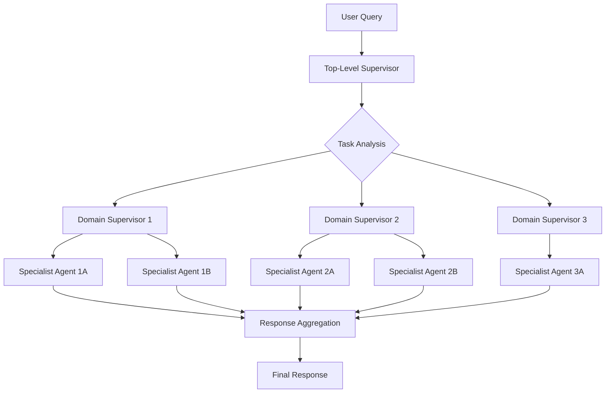
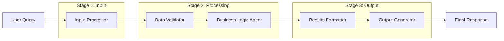
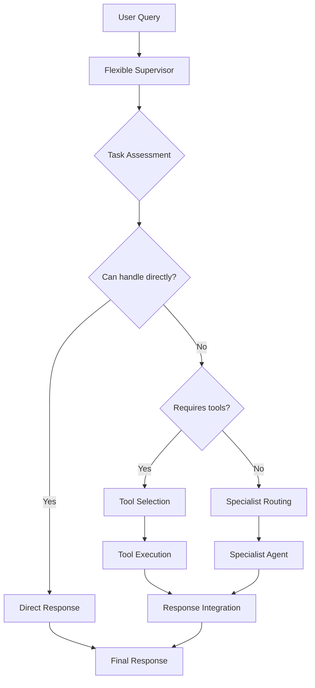
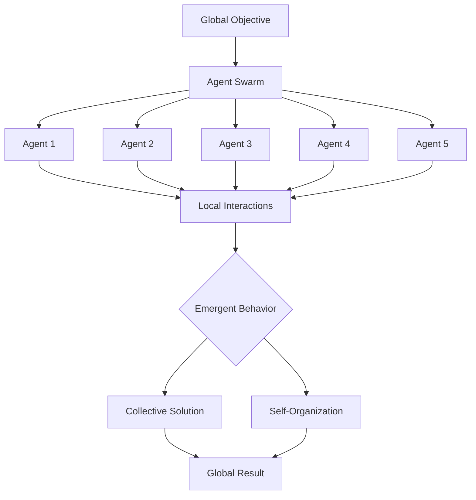
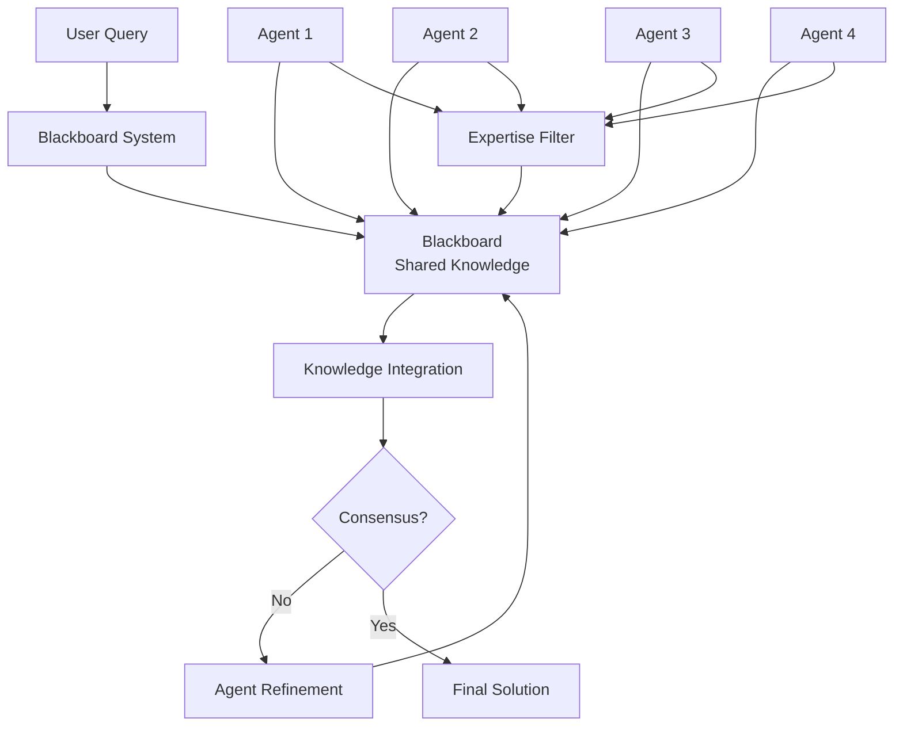
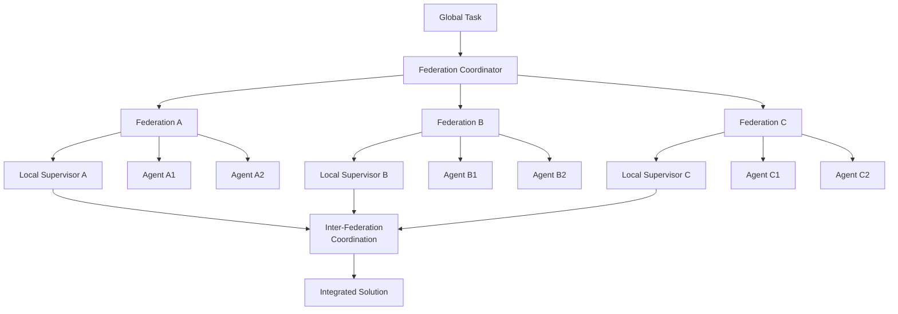
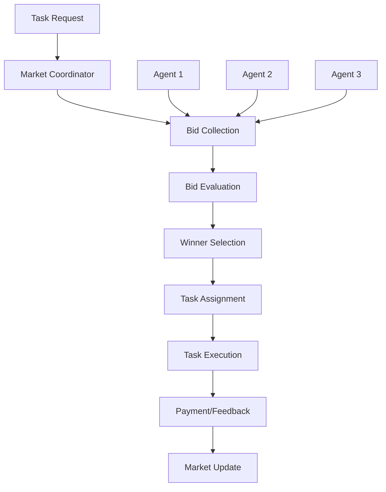
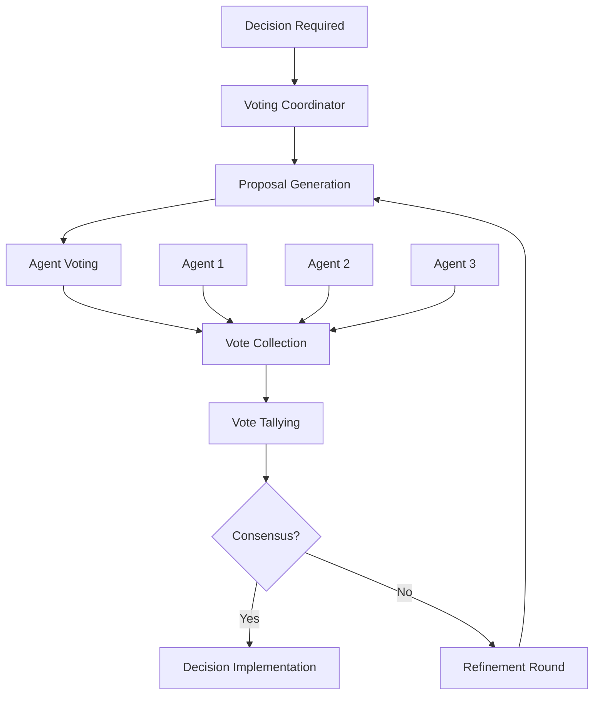
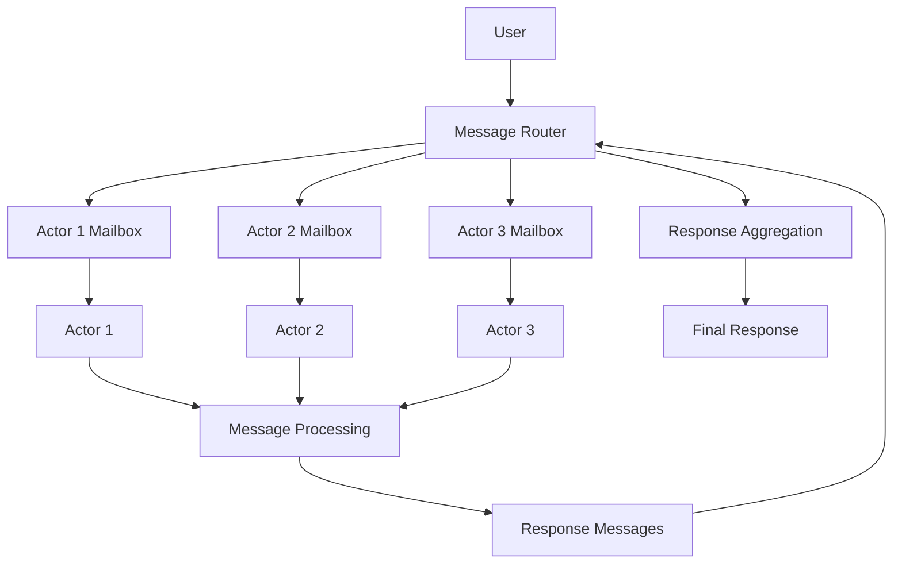
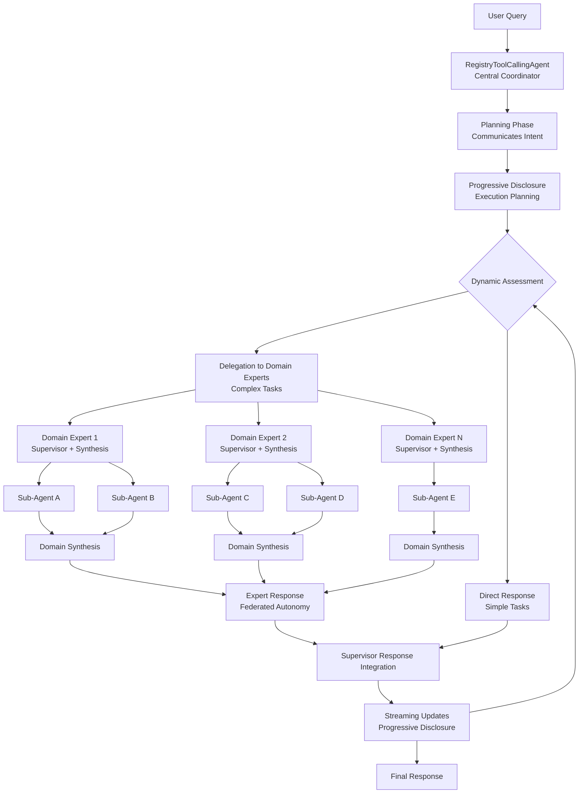

# Multi-Agent Architecture

A comprehensive framework for building scalable multi-agent systems with multiple architectural patterns and production-ready implementations.

## Overview

This project provides implementations of various multi-agent architecture patterns, focusing on hierarchical supervisor systems with MLflow integration for enterprise deployment. The architecture supports different coordination patterns including tool-calling, streaming responses, and circuit breaker resilience.

## Multi-Agent Patterns & Flow Charts

### 1. Hierarchical Architecture

**Description**: Tree-like structure with parent-child relationships where higher-level agents manage and coordinate lower-level specialists.



**Key Characteristics:**
- Clear chain of command and responsibility
- Natural delegation of complex tasks
- Fault isolation by hierarchy level
- Scales vertically (adding layers)

### 2. Pipeline/Sequential Architecture

**Description**: Fixed chain of agents where each agent processes and passes results to the next agent in sequence.



**Key Characteristics:**
- Predictable, linear flow
- Easy to optimize individual stages
- Clear data lineage
- Handles staged processing well

### 3. Flexible Supervisor (Task-Oriented)

**Description**: Intelligent supervisor that can handle tasks directly, use tools, or route to specialists based on task requirements.



**Key Characteristics:**
- Dynamic routing based on actual needs
- Supervisor maintains direct capabilities
- Planning-driven approach
- Optimizes execution path per request

### 4. Swarm Architecture

**Description**: Many simple, autonomous agents that interact locally to achieve global objectives through emergent behavior.



**Key Characteristics:**
- Highly fault-tolerant
- Self-organizing and adaptive
- Natural load distribution
- Emergent intelligence from simple rules

### 5. Blackboard Architecture

**Description**: Shared knowledge space where agents contribute information and solutions collaboratively.



**Key Characteristics:**
- Supports heterogeneous agents
- Natural knowledge accumulation
- Flexible agent participation
- Iterative refinement of solutions

### 6. Federated Architecture

**Description**: Distributed autonomous agents with local decision-making authority that coordinate when needed.



**Key Characteristics:**
- High autonomy and local optimization
- Natural fault isolation
- Good for geographically distributed systems
- Respects organizational boundaries

## Coordination Patterns

### 1. Market-Based Coordination



### 2. Democratic/Voting Coordination



### 3. Actor Model Coordination



## Implementation Examples

### FMAPI Supervisor Agent

A hybrid multi-agent architecture combining **hierarchical coordination**, **federated autonomy**, and **progressive disclosure** patterns:



**Hybrid Architecture Characteristics:**
- **Hierarchical**: Multi-level coordination where central supervisor delegates to domain expert supervisors
- **Federated**: Each domain expert maintains autonomous planning and orchestrates sub-agents
- **Progressive Disclosure**: Communicates intentions and dynamically plans execution steps
- **Distributed Synthesis**: Domain experts perform their own synthesis before forwarding to supervisor
- **Real-time Feedback Loop**: Streaming updates can trigger re-assessment during response generation

**Key Features:**
- Intelligent task routing with LLM-driven analysis and intent communication
- Hierarchical domain experts that orchestrate specialized sub-agents
- Distributed synthesis and response integration across multiple levels
- Real-time feedback loops from streaming updates to dynamic assessment for continuous improvement
- Progressive disclosure with streaming updates and reasoning
- Comprehensive error handling and recovery across federated agent hierarchies
- Production observability with MLflow tracing and streaming events

→ [Detailed Documentation](src/multi_agent/supervisor/README_fmapi_supervisor_agent.md)

## Hybrid Patterns

Most production systems combine multiple architectural patterns to achieve optimal results. The FMAPI Supervisor Agent exemplifies this approach by integrating:

- **Multi-level hierarchical coordination** where domain experts themselves orchestrate sub-agents
- **Federated autonomy** with distributed synthesis and independent execution planning
- **Progressive disclosure** for transparent multi-level execution planning
- **Real-time feedback loops** enabling continuous assessment during streaming response generation

This hybrid design creates a sophisticated hierarchy where domain experts act as mini-supervisors, performing their own synthesis before forwarding results to the central coordinator, with real-time feedback loops from streaming updates enabling continuous improvement through dynamic re-assessment.

## Pattern Selection Guide

| Pattern | Complexity | Scalability | Fault Tolerance | Flexibility | Use Case |
|---------|------------|-------------|----------------|-------------|----------|
| Hierarchical | Low | Medium | Low | Low | Enterprise workflows, clear authority |
| Pipeline | Low | Low | Low | Low | ETL, content processing |
| Flexible Supervisor | High | Medium | Medium | High | General assistants, adaptive tasks |
| Swarm | Medium | High | High | High | Optimization, distributed sensing |
| Blackboard | Medium | Medium | Medium | High | Multi-expert collaboration |
| Federated | High | High | High | Medium | Multi-organization systems |
| **Hybrid (Hierarchical + Federated)** | **Medium-High** | **High** | **High** | **High** | **Complex adaptive systems, progressive disclosure** |

## Quick Start

### Basic Usage

```python
# FMAPI Supervisor Agent
from src.multi_agent.supervisor.fmapi_supervisor_agent import AGENT
response = AGENT.predict_stream(request)
```

## Documentation

- [FMAPI Supervisor Agent](src/multi_agent/supervisor/README_fmapi_supervisor_agent.md) - Tool-calling implementation details


## License

MIT License - see individual component documentation for specific licensing details.
