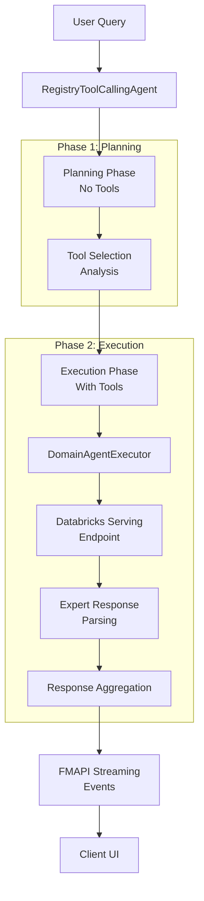
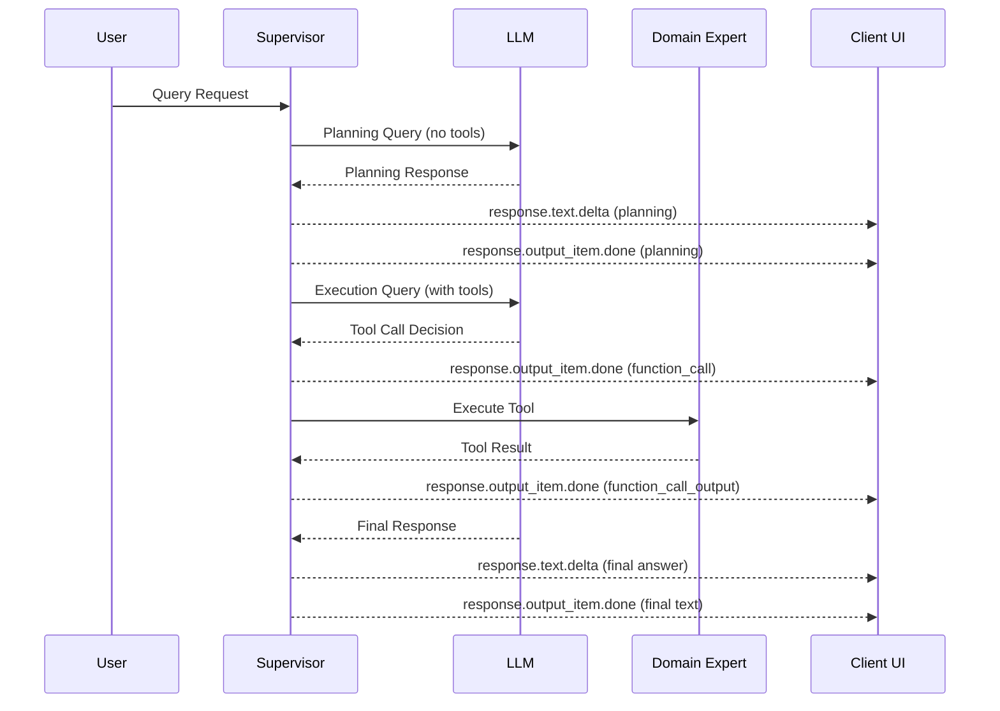

# FMAPI Supervisor Agent

An MLflow ResponsesAgent that implements a multi-agent architecture using tool-calling patterns. The supervisor orchestrates domain experts as OpenAI-compatible function tools, enabling task delegation and streaming responses compatible with FMAPI UIs.

## Overview

The FMAPI Supervisor Agent implements a hierarchical multi-agent architecture where a central supervisor coordinates specialized domain experts. Built on the MLflow ResponsesAgent framework, it provides:

- **Intelligent Task Routing**: LLM-driven analysis of user queries with automatic delegation to appropriate domain experts
- **Streaming Responses**: Real-time token streaming with FMAPI-compatible event emission for responsive UIs
- **Robust Error Handling**: Comprehensive validation, error recovery, and fallback mechanisms
- **Production Observability**: Full MLflow tracing integration for monitoring and debugging
- **Enterprise Integration**: Support for Databricks Model Serving endpoints with OAuth and service principal authentication

## Architecture

### System Design

The FMAPI Supervisor Agent follows a layered architecture with clear separation of concerns:

1. **Orchestration Layer** (`RegistryToolCallingAgent`): Central coordinator implementing the supervisor logic
2. **Registry Layer** (`AgentRegistry`): Expert discovery and management with intelligent routing
3. **Execution Layer** (`DomainAgentExecutor`): Individual expert invocation and response handling
4. **Configuration Layer** (`AgentConfig`, `SupervisorConfig`): Declarative configuration management
5. **Integration Layer**: MLflow, Databricks, and FMAPI protocol adapters

### Data Flow Architecture



### Core Components

| Component | Responsibility | Key Implementation Details |
|-----------|----------------|---------------------------|
| `RegistryToolCallingAgent` | Main supervisor orchestration | Implements ResponsesAgent interface, manages tool-calling loops, handles streaming event emission |
| `AgentRegistry` | Expert discovery and routing | Fuzzy name resolution algorithm, OpenAI tool spec generation, in-memory expert mapping |
| `DomainAgentExecutor` | Individual expert execution | Synchronous endpoint invocation, response format normalization, error handling |
| `AgentConfig` | Expert configuration | Declarative configuration with capabilities metadata for routing |
| `ToolInfo` | Tool specification container | OpenAI function schema with execution function binding |

### Key Design Patterns

- **Tool-Calling Pattern**: Leverages LLM function calling for intelligent task delegation
- **Registry Pattern**: Centralized expert management with fuzzy resolution
- **Factory Pattern**: Declarative agent construction and configuration
- **Adapter Pattern**: Protocol translation between MLflow, Databricks, and FMAPI
- **Streaming Iterator Pattern**: Real-time event emission with backpressure handling

## Installation & Setup

### Prerequisites

- **Python**: 3.9 or higher
- **Databricks Workspace**: With Model Serving endpoints configured
- **MLflow**: Version 2.8.0 or higher
- **Databricks Authentication**: Valid workspace access token or service principal

### Dependencies

Install the required dependencies:

```bash
pip install mlflow>=2.8.0 databricks-sdk>=0.65.0 pydantic>=2.11.0
```

For development:

   ```bash
pip install -e .
```

### Authentication Configuration

Configure Databricks authentication using the OAuth pattern:

**Interactive OAuth Login (Recommended for Development):**
```bash
# Install Databricks CLI
pip install databricks-cli

# Login using OAuth
databricks auth login --host https://your-workspace.cloud.databricks.com
```

**Service Principal (For Automated Deployments):**
```bash
export DATABRICKS_CLIENT_ID="your-client-id"
export DATABRICKS_CLIENT_SECRET="your-client-secret"
   export DATABRICKS_HOST="https://your-workspace.cloud.databricks.com"
```

**Manual Token Configuration (Legacy):**
```bash
export DATABRICKS_HOST="https://your-workspace.cloud.databricks.com"
export DATABRICKS_TOKEN="your-personal-access-token"
```

The Databricks SDK will automatically detect and use the appropriate authentication method based on your environment configuration.

### Agent Initialization

**Using Default Configuration:**
   ```python
   from multi_agent.supervisor.fmapi_supervisor_agent import AGENT

# Ready-to-use agent with pre-configured domain experts
response = AGENT.predict_stream(request)
```

**Custom Configuration:**
```python
from multi_agent.supervisor.fmapi_supervisor_agent import (
    SupervisorConfig, AgentRegistry, create_registry_supervisor_agent
)

# Configure supervisor settings
config = SupervisorConfig(
    llm_endpoint="databricks-claude-3-7-sonnet",
    max_steps=15
)

# Build custom agent registry
registry = AgentRegistry([...])  # Custom domain experts

# Create supervisor agent
agent = create_registry_supervisor_agent(
    llm_endpoint=config.llm_endpoint,
    registry=registry
)
```

## Quick Start

### Basic Usage

**Streaming Response Processing:**
```python
from mlflow.types.responses import ResponsesAgentRequest
from multi_agent.supervisor.fmapi_supervisor_agent import AGENT

# Create request with user query
request = ResponsesAgentRequest(
    input=[{"role": "user", "content": "Analyze automotive coatings market trends and calculate (3^6)/6"}]
)

# Process streaming events
for event in AGENT.predict_stream(request):
    if event.type == "response.text.delta":
        # Handle incremental text content
        print(event.delta.content, end="", flush=True)
    elif event.type == "response.output_item.done":
        # Handle completed output items (text, tool calls, tool outputs)
        item = event.item
        if item.get("type") == "function_call":
            print(f"\n[TOOL CALL] {item.get('name')}: {item.get('arguments')}")
        elif item.get("type") == "function_call_output":
            print(f"\n[TOOL RESULT] {item.get('output')[:200]}...")
```

**Non-Streaming Response:**
```python
# Get complete response in single call
response = AGENT.predict(request)
for item in response.output:
    print(f"Output Item: {item}")
```

### Command Line Testing

**Interactive Testing Script:**
```bash
# Activate virtual environment
source .venv/bin/activate

# Test with default query
python tests/integration/stream_fmapi_supervisor.py

# Test with custom query
python tests/integration/stream_fmapi_supervisor.py \
    --question "Provide detailed analysis of coatings industry trends"

# Test with specific supervisor endpoint
python tests/integration/stream_fmapi_supervisor.py \
    --question "Calculate mathematical expression: (3^6)/6" \
    --supervisor-endpoint "databricks-claude-3-7-sonnet"
```

**Expected Output:**
```
=== Streaming ===
Based on your query about coatings industry trends and mathematical calculation, I should use the CoatingsSupervisorAgent for the industry analysis and GenomicsSupervisorAgent for the computation.

[TOOL CALL] CoatingsSupervisorAgent args={"instruction": "Analyze current automotive coatings market trends"}
[TOOL OUT] output={"status": "ok", "data": "Detailed analysis of coatings market...", "meta": {"agent_name": "CoatingsSupervisorAgent"}}...
[TOOL CALL] GenomicsSupervisorAgent args={"instruction": "Calculate (3^6)/6"}
[TOOL OUT] output={"status": "ok", "data": "Calculation result: 1458/6 = 243", "meta": {"agent_name": "GenomicsSupervisorAgent"}}...
=== Done ===
```

## Configuration

### Supervisor Configuration

The supervisor behavior is controlled through the `SupervisorConfig` dataclass:

```python
@dataclass
class SupervisorConfig:
    """Top-level supervisor configuration."""
    llm_endpoint: str = "databricks-claude-3-7-sonnet"  # Databricks model serving endpoint
    thinking_enabled: bool = True                       # Reserved for reasoning-style prompts
    max_steps: int = 10                                 # Safety limit for tool-calling iterations
```

**Key Parameters:**
- `llm_endpoint`: Databricks Serving endpoint for the supervisor LLM
- `max_steps`: Prevents infinite loops in tool-calling chains (default: 10)
- `thinking_enabled`: Future flag for enabling reasoning traces

### Domain Expert Configuration

Each domain expert is configured through the `AgentConfig` dataclass:

```python
@dataclass
class AgentConfig:
    """Configuration for a domain expert."""
    name: str                           # Unique expert identifier (used as tool name)
    description: str                    # Human-readable description for routing
    endpoint: str                       # Databricks model serving endpoint
    system_prompt: str                  # System message for expert initialization
    capabilities: Optional[str] = None  # Specific capabilities for tool selection
    domain: Optional[str] = None        # Domain specialization metadata
```

### Default Configuration

**Pre-configured Domain Experts:**
```python
DEFAULT_AGENTS = [
    AgentConfig(
        name="CoatingsSupervisorAgent",
        description="Coatings industry SME for market news search and plant data analysis",
        endpoint="genie_multi_agent_basf",
        system_prompt="You are a coatings industry expert specializing in automotive coatings...",
        capabilities="semantic similarity search for coatings/automotive industry news, SQL-based analytics for automotive manufacturing plants",
        domain="chemical_data",
    ),
    AgentConfig(
        name="GenomicsSupervisorAgent",
        description="Computational expert for mathematical calculations, Python execution, and data analysis",
        endpoint="genie_multi_agent_basf_v2",
        system_prompt="You are a computational expert specialized in mathematical calculations...",
        capabilities="arithmetic calculations, mathematical computations, Python code execution, SQL-based data queries",
        domain="computational_tools",
    ),
]
```

### Custom Agent Registry

**Building Custom Registries:**
```python
from multi_agent.supervisor.fmapi_supervisor_agent import (
    AgentConfig, AgentRegistry, DomainAgentExecutor,
    create_registry_supervisor_agent
)

# Define domain-specific experts
custom_agents = [
    AgentConfig(
        name="FinancialAnalystAgent",
        description="Financial analysis and market research expert",
        endpoint="financial-analysis-endpoint",
        system_prompt="You are a financial analysis expert...",
        capabilities="financial modeling, market analysis, risk assessment",
        domain="finance",
    ),
    AgentConfig(
        name="DataScientistAgent",
        description="Statistical analysis and machine learning expert",
        endpoint="data-science-endpoint",
        system_prompt="You are a data science expert...",
        capabilities="statistical analysis, machine learning, data visualization",
        domain="data_science",
    ),
]

# Create executors and registry
executors = [DomainAgentExecutor(config) for config in custom_agents]
registry = AgentRegistry(executors)

# Build supervisor with custom registry
supervisor = create_registry_supervisor_agent(
    llm_endpoint="databricks-claude-3-7-sonnet",
    registry=registry,
    system_prompt="You are a multi-domain supervisor coordinating specialized experts..."
)
```

### Tool Specification Generation

**Automatic Tool Schema Generation:**
The agent automatically generates OpenAI-compatible tool specifications:

```python
# Tool specs are generated from AgentConfig metadata
tool_specs = registry.tool_specs()
# Returns OpenAI function schema with descriptions, parameters, and capabilities
```

**Tool Parameter Schema:**
```json
{
  "type": "function",
  "function": {
    "name": "CoatingsSupervisorAgent",
    "description": "Coatings industry SME for market news search... | Capabilities: semantic similarity search... | Domain: chemical_data",
    "parameters": {
      "type": "object",
      "properties": {
        "instruction": {
          "type": "string",
          "description": "Precise task for the expert to perform"
        }
      },
      "required": ["instruction"]
    }
  }
}
```

## API Reference

### RegistryToolCallingAgent

The main supervisor agent implementing the ResponsesAgent interface with tool orchestration capabilities.

#### Constructor

```python
RegistryToolCallingAgent(
    llm_endpoint: str,
    registry: AgentRegistry,
    system_prompt: Optional[str] = None
)
```

**Parameters:**
- `llm_endpoint` (str): Databricks model serving endpoint name for the supervisor LLM
- `registry` (AgentRegistry): Registry containing domain expert configurations
- `system_prompt` (Optional[str]): Custom system prompt for the supervisor (uses default if None)

**Implementation Details:**
- Initializes Databricks workspace client and OpenAI-compatible client
- Builds tool specifications from registry configurations
- Sets up MLflow tracing spans for observability

#### Core Methods

##### `predict(request: ResponsesAgentRequest) -> ResponsesAgentResponse`

Non-streaming prediction that aggregates all output items.

```python
def predict(self, request: ResponsesAgentRequest) -> ResponsesAgentResponse:
    outputs = [
        event.item
        for event in self.predict_stream(request)
        if event.type == "response.output_item.done"
    ]
    return ResponsesAgentResponse(output=outputs, custom_outputs=request.custom_inputs)
```

##### `predict_stream(request: ResponsesAgentRequest) -> Generator[ResponsesAgentStreamEvent]`

Streaming prediction API implementing the two-phase execution model.

**Phase 1 - Planning:** Generates a brief plan without tool access
**Phase 2 - Execution:** Executes tools based on the planning phase

```python
def predict_stream(self, request: ResponsesAgentRequest) -> Generator[ResponsesAgentStreamEvent]:
    # Phase 1: Planning turn without tools
    planning_content = self._generate_planning_response(messages)

    # Phase 2: Tool-enabled execution
    yield from self.call_and_run_tools(messages)
```

##### `call_and_run_tools(messages: List[Dict], max_iter: int = 10)`

Main tool-calling orchestration loop with safety limits.

**Algorithm:**
1. Stream LLM response with tool access
2. Extract and execute tool calls
3. Append tool results to conversation
4. Repeat until no more tool calls or max_iter reached

##### `handle_tool_calls(messages, tool_calls)`

Executes tool calls and streams results back to the client.

**Features:**
- Parallel tool execution support
- Structured error handling with status codes
- FMAPI-compatible event emission

### AgentRegistry

Central registry for domain expert management with intelligent routing.

#### Constructor

```python
AgentRegistry(agents: List[DomainAgentExecutor])
```

**Implementation:**
- Creates in-memory mapping of agent names to executors
- Maintains separate list of configurations for metadata access

#### Methods

##### `resolve(name: str) -> Optional[str]`

Implements fuzzy name resolution with fallback hierarchy:

1. **Exact Match:** Direct dictionary lookup
2. **Case-Insensitive Match:** Lowercase comparison
3. **Close Match:** difflib-based string similarity (cutoff=0.6)

##### `tool_specs() -> List[dict]`

Generates OpenAI-compatible function specifications:

```python
def tool_specs(self) -> List[dict]:
    specs = []
    for cfg in self._configs:
        description = " | ".join([
            cfg.description,
            f"Capabilities: {cfg.capabilities}" if cfg.capabilities else "",
            f"Domain: {cfg.domain}" if cfg.domain else ""
        ])
        specs.append({
            "type": "function",
            "function": {
                "name": cfg.name,
                "description": description,
                "parameters": AgentCallArgs.model_json_schema()
            }
        })
    return specs
```

### DomainAgentExecutor

Handles individual domain expert execution via Databricks Serving endpoints.

#### Constructor

```python
DomainAgentExecutor(config: AgentConfig, workspace_client: Optional[WorkspaceClient] = None)
```

**Initialization:**
- Creates Databricks workspace client (or uses provided client)
- Initializes OpenAI-compatible client for endpoint access

#### Methods

##### `execute(query: str) -> str`

Synchronous endpoint invocation with robust response parsing.

**Implementation:**
```python
def execute(self, query: str) -> str:
    messages = [
        {"role": "system", "content": self.config.system_prompt},
        {"role": "user", "content": query}
    ]

    response = self._client.chat.completions.create(
        model=self.config.endpoint,
        messages=messages,
        temperature=0.2,
        max_tokens=1000
    )

    # Robust response parsing with multiple fallback strategies
    return self._extract_content(response)
```

**Response Parsing Strategy:**
1. Extract from `response.choices[0].message.content`
2. Fallback to alternative content fields (`text`, `response`, `output`, etc.)
3. Handle different response formats from various model endpoints

### Data Models

#### AgentConfig

Configuration container for domain expert specifications.

```python
@dataclass
class AgentConfig:
    name: str                           # Unique identifier and tool name
    description: str                    # Human-readable routing description
    endpoint: str                       # Databricks serving endpoint name
    system_prompt: str                  # Expert initialization prompt
    capabilities: Optional[str] = None  # Specific capabilities for routing
    domain: Optional[str] = None        # Domain specialization metadata
```

#### AgentCallArgs

Pydantic model for type-safe tool call arguments.

```python
class AgentCallArgs(BaseModel):
    instruction: str  # Required task instruction for the expert

    model_config = {"strict": True}  # Enforce strict validation
```

#### ToolInfo

Lightweight container for tool specifications and execution.

```python
@dataclass
class ToolInfo:
    name: str                           # Tool name
    spec: Dict[str, Any]               # OpenAI function schema
    exec_fn: Callable[..., Any]        # Bound execution function
```

## Streaming Events & FMAPI Protocol

The agent implements the MLflow ResponsesAgent streaming protocol with FMAPI-compatible event emission.

### Event Types

| Event Type | Description | Data Structure | Frequency |
|------------|-------------|----------------|-----------|
| `response.text.delta` | Incremental text content from supervisor LLM | `{"delta": {"content": "text"}}` | Per token/chunk |
| `response.output_item.done` | Completed output items (text, tool calls, results) | `{"item": {...}}` | Per completed item |
| `response.output_text.delta` | Legacy text delta format | `{"delta": {"content": "text"}}` | Per token/chunk |

### Event Flow Architecture



### Two-Phase Streaming Algorithm

#### Phase 1: Planning (No Tools)
```python
# Modify user query for planning
messages[-1]["content"] = f"Respond with exactly one sentence: what tool will you use for this task? Original query: {original_content}"

# Stream planning response with length limit
for chunk in self.call_llm(messages, tools=[]):
    planning_content += chunk["choices"][0]["delta"].get("content", "")
    yield ResponsesAgentStreamEvent(**self.create_text_delta(content, item_id=stream_item_id))

    # Early termination conditions
    if len(planning_content) > max_planning_length or planning_content.strip().endswith('.'):
        break
```

#### Phase 2: Tool-Enabled Execution
```python
# Main tool-calling loop
for iteration in range(max_iter):
    # Stream LLM response with tool access
    for chunk in self.call_llm(messages):
        # Handle tool call accumulation across chunks
        if tool_calls := chunk["choices"][0]["delta"].get("tool_calls"):
            if not tool_calls_accumulator:
                tool_calls_accumulator = tool_calls
            else:
                # Accumulate streaming arguments
                tool_calls_accumulator[0]["function"]["arguments"] += tool_calls[0]["function"]["arguments"]

        # Emit text deltas
        if content := chunk["choices"][0]["delta"].get("content"):
            yield ResponsesAgentStreamEvent(**self.create_text_delta(content, item_id=stream_item_id))

    # Execute accumulated tool calls
    if tool_calls_accumulator:
        yield from self.handle_tool_calls(messages, tool_calls_accumulator)

    # Continue if assistant message indicates more tool calls needed
    elif (last_msg.get("role") == "assistant" and iteration > 0):
        return  # Exit if no more tool calls
```

### Tool Call Argument Accumulation

The agent handles streaming tool call arguments that may arrive across multiple chunks:

```python
# Initialize accumulator on first tool_calls chunk
if not tool_calls:
    tool_calls = tc  # First chunk
else:
    # Append to existing arguments for subsequent chunks
    tool_calls[0]["function"]["arguments"] += tc[0]["function"]["arguments"]
```

### Error Handling in Streaming

```python
# Tool execution with structured error handling
try:
    args = AgentCallArgs.model_validate(tool_args)
    resolved_name = self.registry.resolve(tool_name)
    result = self.registry.get(resolved_name).execute(args.instruction)

    # Success response
    response = {
        "status": "ok",
        "data": result,
        "meta": {"agent_name": resolved_name}
    }

except ValidationError as ve:
    # Validation error
    response = {
        "status": "error",
        "data": {"validation_errors": ve.json()},
        "meta": {"agent_name": tool_name}
    }

except Exception as e:
    # Execution error
    response = {
        "status": "error",
        "data": {"error": str(e)},
        "meta": {"agent_name": resolved_name}
    }
```

## Testing & Quality Assurance

### Available Test Scripts

The project includes basic test scripts for manual validation:

#### Manual Integration Tests
```bash
# Test streaming supervisor agent manually
python tests/integration/stream_fmapi_supervisor.py

# Test Databricks connectivity
python tests/integration/test_databricks_connectivity.py
```

#### Basic Unit Test Scripts
```bash
# Basic unit tests for progressive agent components
python tests/unit/progressive_agent/test_supervisor_stream.py
python tests/unit/progressive_agent/test_minimal_calls.py
python tests/unit/progressive_agent/test_tools_registry.py
```

**Note**: These are manual test scripts for basic validation.

### Manual Testing & Validation

#### Interactive Testing Script
```python
from mlflow.types.responses import ResponsesAgentRequest
from multi_agent.supervisor.fmapi_supervisor_agent import AGENT

def test_agent_response(question: str):
    """Test agent with detailed event logging."""
request = ResponsesAgentRequest(input=[{"role": "user", "content": question}])

    print(f"Testing: {question}")
    print("=" * 50)

for event in AGENT.predict_stream(request):
    print(f"Event: {event.type}")

        if event.type == "response.text.delta":
            delta = event.delta
            if hasattr(delta, 'content') and delta.content:
                print(f"Text Delta: {delta.content}", end="", flush=True)

        elif event.type == "response.output_item.done":
            item = event.item
            if hasattr(item, 'type'):
                if item.type == "function_call":
                    print(f"Tool Call: {item.name} -> {item.arguments}")
                elif item.type == "function_call_output":
                    print(f"Tool Result: {item.output[:100]}...")

    print("\n" + "=" * 50)

# Test various scenarios
test_agent_response("Analyze automotive coatings market trends")
test_agent_response("Calculate (3^6)/6 and explain the result")
test_agent_response("What tools are available for computational tasks?")
```

#### Health Check Validation
```python
def health_check():
    """Validate agent configuration and connectivity."""
    registry = AGENT.registry

    print("Agent Health Check")
    print("=" * 30)

    # Check registry configuration
    configs = registry.list_configs()
    print(f"Registered Experts: {len(configs)}")
    for config in configs:
        print(f"  - {config.name}: {config.endpoint}")

    # Test tool specifications
    tool_specs = AGENT.get_tool_specs()
    print(f"Tool Specifications: {len(tool_specs)}")

    # Test individual expert connectivity
    for config in configs:
        try:
            executor = registry.get(config.name)
            result = executor.execute("Health check: respond with 'OK'")
            print(f"  ✓ {config.name}: {result.strip()[:50]}...")
        except Exception as e:
            print(f"  ✗ {config.name}: {str(e)}")

health_check()
```

### Test Scenarios

#### Functional Tests
- **Single Tool Execution**: Verify individual expert invocation
- **Multi-Tool Orchestration**: Test complex task decomposition
- **Streaming Performance**: Validate real-time response quality
- **Error Recovery**: Test fault tolerance and graceful degradation

#### Edge Cases
- **Empty Responses**: Handle domain experts returning no content
- **Tool Resolution**: Test fuzzy name matching and fallbacks
- **Authentication Failures**: Validate error handling for Databricks connectivity
- **Rate Limiting**: Test behavior under endpoint throttling

#### Performance Benchmarks
- **Latency**: Measure end-to-end response times
- **Throughput**: Validate concurrent request handling
- **Memory Usage**: Monitor resource consumption during streaming
- **Tool Call Efficiency**: Measure tool selection accuracy

## Implementation Details


#### Two-Phase Streaming Algorithm

The agent implements a novel two-phase approach to streaming:

**Phase 1: Planning (No Tools)**
- Forces LLM to reason about tool selection without execution
- Generates concise planning response (limited to 200 characters)
- Early termination on sentence completion (period detection)
- Prevents verbose planning that delays execution

**Phase 2: Tool-Enabled Execution**
- Full tool access for complex task execution
- Iterative tool-calling loop with safety bounds
- Streaming tool call argument accumulation
- Structured error handling and recovery

**Key Innovation**: Planning-first approach reduces latency by enabling parallel tool preparation while maintaining coherent execution flow.

#### Tool Call Argument Accumulation

Handles OpenAI's streaming tool call format where arguments arrive across multiple chunks:

```python
# Streaming chunks may contain partial arguments
chunk_1 = {"tool_calls": [{"function": {"arguments": '{"task": '}}]}
chunk_2 = {"tool_calls": [{"function": {"arguments": '"analyze data"'}}]}
chunk_3 = {"tool_calls": [{"function": {"arguments": '}'}}]}

# Accumulation logic
if not accumulated_calls:
    accumulated_calls = chunk.tool_calls
else:
    # Append to existing arguments string
    accumulated_calls[0]["function"]["arguments"] += chunk.tool_calls[0]["function"]["arguments"]
```

**Result**: `{"task": "analyze data"}` reconstructed from streaming chunks

### Design Patterns

#### Tool-Calling Pattern Implementation

```python
class RegistryToolCallingAgent(ResponsesAgent):
    def __init__(self, llm_endpoint: str, registry: AgentRegistry):
        # Bind tools to execution functions
        self._tools_dict: Dict[str, ToolInfo] = {}
        for tool_spec in self._build_tool_specs_from_registry():
            tool_name = tool_spec["function"]["name"]
            self._tools_dict[tool_name] = ToolInfo(
                name=tool_name,
                spec=tool_spec,
                exec_fn=partial(self._exec_tool_by_name, tool_name)
            )
```

**Pattern Benefits:**
- Decouples tool specification from execution
- Enables dynamic tool registration
- Supports partial function application for context binding

#### Registry Pattern for Expert Management

```python
class AgentRegistry:
    def __init__(self, agents: List[DomainAgentExecutor]):
        self._by_name: Dict[str, DomainAgentExecutor] = {
            agent.config.name: agent for agent in agents
        }
        self._configs: List[AgentConfig] = [
            agent.config for agent in agents
        ]
```

**Registry Features:**
- **Centralized Management**: Single source of truth for expert metadata
- **Lazy Resolution**: On-demand expert instantiation
- **Metadata Separation**: Configuration separate from execution logic
- **Thread Safety**: Immutable configuration with isolated execution

#### Adapter Pattern for Protocol Translation

The agent translates between multiple protocols:

- **MLflow Responses API** ↔ **OpenAI Chat Completions API**
- **FMAPI Events** ↔ **Internal Streaming Format**
- **Databricks Serving** ↔ **OpenAI-Compatible Client**

```python
def _responses_to_cc(self, message: Dict[str, Any]) -> List[Dict[str, Any]]:
    """Translate Responses API messages to Chat Completions format."""
    msg_type = message.get("type")
    if msg_type == "function_call":
        return [{
            "role": "assistant",
            "content": "tool call",  # Claude compatibility
            "tool_calls": [{
                "id": message["call_id"],
                "type": "function",
                "function": {
                    "arguments": message["arguments"],
                    "name": message["name"]
                }
            }]
        }]
```

### Error Handling Strategies

#### Structured Error Response Format

All tool executions return structured responses:

```python
# Success response
{
    "status": "ok",
    "data": "expert response content",
    "meta": {"agent_name": "ResolvedExpertName"}
}

# Error response
{
    "status": "error",
    "data": {"error": "description", "validation_errors": [...]},
    "meta": {"agent_name": "AttemptedExpertName"}
}
```

#### Validation Error Handling

```python
@mlflow.trace(span_type=SpanType.TOOL)
def execute_tool(self, tool_name: str, args: Dict[str, Any]) -> Any:
    try:
        # Type-safe validation using Pydantic
        validated_args = AgentCallArgs.model_validate(args)
    except ValidationError as ve:
        return {
            "status": "error",
            "data": {"validation_errors": json.loads(ve.json())},
            "meta": {"agent_name": tool_name}
        }
```

#### Robust Response Parsing

The `DomainAgentExecutor` implements multi-tier response extraction:

```python
def _extract_content(self, response) -> str:
    """Extract content using multiple fallback strategies."""
    # Strategy 1: Standard OpenAI format
    if response.choices and response.choices[0].message.content:
        return response.choices[0].message.content

    # Strategy 2: Alternative content fields
    for field in ['text', 'response', 'output', 'result', 'answer']:
        if hasattr(response.choices[0].message, field):
            value = getattr(response.choices[0].message, field)
            if value and isinstance(value, str) and value.strip():
                return value

    # Strategy 3: Direct response parsing
    if hasattr(response, "messages"):
        for msg in response.messages:
            if msg.get("role") == "assistant" and "content" in msg:
                return msg["content"]

    return ""  # Empty string indicates parsing failure
```


#### Observability Integration

```python
@mlflow.trace(span_type=SpanType.LLM)
def call_llm(self, messages: List[Dict[str, Any]], tools: Optional[List[Dict[str, Any]]] = None):
    # Automatic MLflow tracing for LLM calls
    pass

@mlflow.trace(span_type=SpanType.TOOL)
def execute_tool(self, tool_name: str, args: Dict[str, Any]):
    # Automatic MLflow tracing for tool execution
    pass
```

**Tracing Benefits:**
- End-to-end request tracking
- Performance bottleneck identification
- Error correlation across components
- Production debugging support


---

**Version**: 1.0.0  
**Last Updated**: September 15, 2025  
**Authors**: AJ (andreas.jack@databricks.com)  
**License**: MIT
