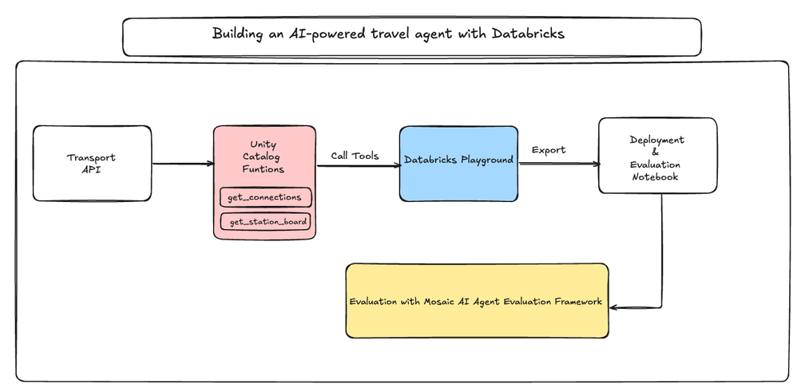

# Marketing Team - Vector Search & Genie API Integration

## Hackathon Goals

**Core Objectives:**
- Build intelligent marketing analytics using vector search and Genie API integration
- Demonstrate data discovery and insights generation across structured and non structured datasets


**Technical Implementation:**
- **Genie Spaces Setup**: Create specialized Genie spaces for structured marketing data.
- **Vector Index Integration**: Implement vector index for semantic search.
- **Domain Agent Integration**: Implement orchestrator into the top-level supervisor architecture


## Key Resources

### Genie API Orchestrator
🤖 **[LangGraph Multi-Agent Genie Pattern](https://docs.databricks.com/aws/en/notebooks/source/generative-ai/langgraph-multiagent-genie-pat.html)** - Reference implementation for orchestrating multiple agents with Genie spaces using LangGraph

### Genie Orchestrator Notebook
🔗 **[LangGraph Multi-Agent](../../notebooks/03-langgraph-multiagent-genie-pat.py)** - Example for Agent and Genie Orchestration

### External API Calling for Multi-tool Integration
External API can be integrated in multi-tool agent by registering Python code as **Unity Catalog functions** as illustrated below. 

Below code snippet showcases a simple GET method to a publicly accessible `transport API`. 
```sql
%sql
CREATE OR REPLACE FUNCTION your_catalog.your_schema.get_transport_connections(
   from_station STRING COMMENT 'The train station of departure',
   to_station STRING COMMENT 'The train station of arrival',
   via_station STRING COMMENT 'The desired stops in between departure and arrival'
)
RETURNS STRING
COMMENT 'Executes a call to the transport API and connections endpoint to retrieve relevant train connections given the input parameters from (departure), to (arrival), via (stops in between, if specified).'
LANGUAGE PYTHON
AS $$
import requests

url = "http://transport.opendata.ch/v1/connections"
params = {
   "from": from_station,
   "to": to_station,
   "via": via_station,
   "transportations": "train"
}

response = requests.get(url, params=params)

if response.status_code == 200:
   next_connection = response.json()
   return next_connection['connections']
else:
   return f"Failed to retrieve connection. Status code: {response.status_code}"
$$;
```

For more advanced API request with AuthN/AuthZ handling, we can add additional logics to retrieve credential token upfront before sending the request. An example use the following code to retrieve the access token for [Uber Freight API](https://developer.uberfreight.com/apis) (differs depending on API specification):

```python
import json
import requests

CLIENT_ID = "YOUR CLIENT ID"
CLIENT_SECRET = "YOUR CLIENT SECRET"

grant_type = 'client_credentials'
body_params = {'grant_type' : grant_type}

url='https://uatapi.uberfreight.com/oauth2/accesstoken'
response = requests.post(url, data=body_params, auth=(CLIENT_ID, CLIENT_SECRET)) 

token_raw = json.loads(response.text)
token = token_raw["access_token"]
```

Afterwards embedd the retrived token in request header for authentication:
```python

url = "https://uatapi.uberfreight.com/tp-api/customer/v2/healthCheck"

# Request parameters if any
params = {
    "param_1": "example value"
}

# Authorization bearer token
headers = {
   "Authorization": "Bearer {}".format(token)
}

response = requests.get(url, params=params, headers=headers)
uber_response = response.json()
print(uber_response)
```


## Optional

### Vector Search & Multi-Tool Integration
🤖 **[UC Multi-Tool Responses Agent](../../src/uc_multi_tool_responses_agent/README.md)** - Multi-tool agent with Vector Index and UC Tools Integration (no Genie support)

📊 **[Agent Evaluation](../../notebooks/04-agent-evaluation-metrics-review-app.py)** - Evaluation frameworks for data discovery agents

## Integration Points

- **ECT Team**: Multi-Genie orchestration patterns
- **Supply Chain Team**: Security patterns for data access
- **Multi-layered Architecture Team**: Supervisor integration examples

